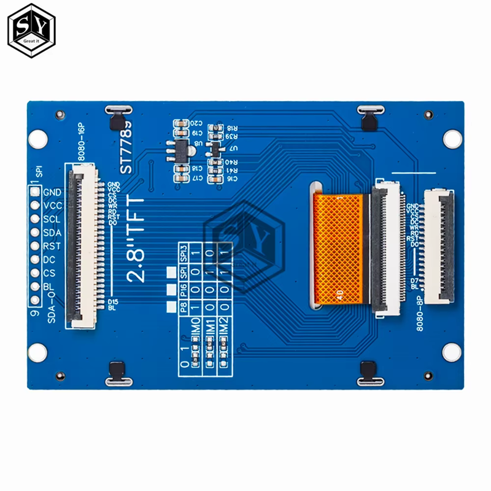

# ESP32_with_Display_Adafruit_ST7789

This small project uses an Adafruit 2.0" 320x240 Color IPS TFT Display working with ESP32, to communicate between the ESP and the display, we will use 

libs: 

lib #include <SPI.h> - SPI Communication
#include <Adafruit_GFX.h> - Graphics Adafruit Lib 
#include <Adafruit_ST7789.h> - Specific Lib for this display

### Connect Display pins to correct ESP32 pins.

  

  

